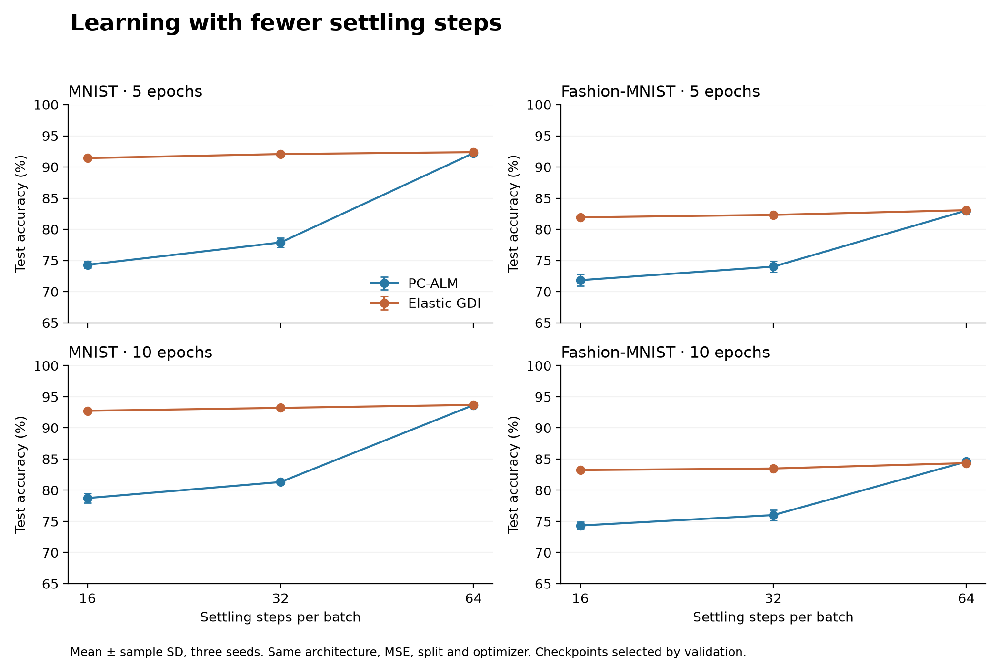
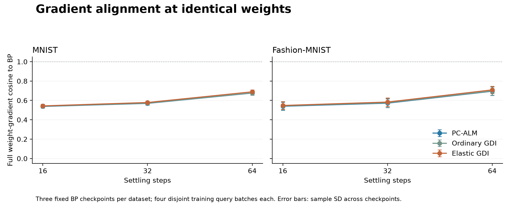
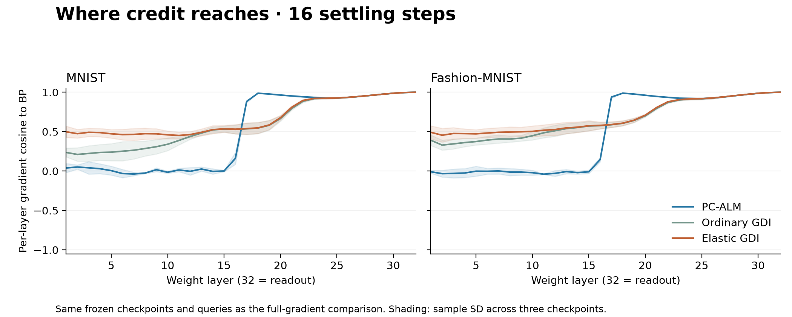

# EDC — Elastic Dual Coupling

**Elastic dual coupling for predictive coding with fewer settling steps.**

[Method](#method) · [Results](#results) · [Gradient comparison](#gradient-comparison) · [Reproduce](#reproduce)

EDC extends augmented Lagrangian predictive coding (PC-ALM) with retrieved
multiplier initialization and a small, fading connection between mirrored layers.
This is an independent research implementation based on
[SakanaAI/pc-alm](https://github.com/SakanaAI/pc-alm), not an official Sakana AI release.


[Vector SVG](assets/architecture.svg) · [Paper PDF](assets/architecture.pdf)

*Schematic: residual hidden blocks and intermediate layers are compressed; grey links
indicate local activity/constraint interaction, not the full derivative graph.*

## Results

**Large gains at 16/32 settling steps; no consistent advantage at 64.**
Three-seed means, matched residual MLP, original MSE and validation-selected checkpoints.
Arrows show **5 → 10 epochs**; values are held-out test accuracy (%).

| Dataset | Steps/batch | PC-ALM | Elastic GDI |
|---|---:|---:|---:|
| MNIST | 16 | 74.30 → 78.74 | **91.43 → 92.74** |
| MNIST | 32 | 77.89 → 81.31 | **92.07 → 93.21** |
| MNIST | 64 | 92.24 → 93.66 | 92.37 → 93.69 |
| Fashion-MNIST | 16 | 71.84 → 74.34 | **81.92 → 83.23** |
| Fashion-MNIST | 32 | 74.01 → 76.01 | **82.31 → 83.48** |
| Fashion-MNIST | 64 | 83.01 → **84.59** | 83.06 → 84.35 |



The PC-ALM comparison includes **both retrieval and elastic coupling**. Against
ordinary GDI alone at 16 steps and ten epochs, coupling improved MNIST
89.69 → 92.74% and Fashion 80.46 → 83.23%, with gains in all six paired trials.

At ten epochs, elastic runs took approximately **24 / 43 / 83 seconds** for
16 / 32 / 64 steps on the experiment's local CPU; PC-ALM took 23 / 42 / 81 seconds.
These include compilation but exclude loading/evaluation and are not portable
hardware benchmarks. BP still achieved higher accuracy in our matched ten-epoch
reference runs: 94.70% MNIST and 84.98% Fashion.

[Per-seed measurements and validation histories](benchmarks/runs) ·
[Checkpoint provenance and SHA-256 hashes](benchmarks/manifest.json)

## Method

For hidden constraint layers `i = 0,…,H−1`, mirror `j = H−1−i`:

```python
# After the ordinary local activity update; both partners read old duals.
strength = 0.05 * max(1 - t / (T // 2 - 1), 0)
duals_next = duals + residual - strength * (duals - duals[::-1])
```

The classifier has 31 hidden constraint layers: 1↔31, 2↔30, …; center layer 16
is untouched. At T=16/32/64, coupling reaches zero at zero-based iteration
7/15/31. The final settling steps refine each multiplier independently.
No extra gradient evaluations or learned parameters are added by coupling.

GDI retrieves starting multipliers from a training-only FIFO bank using hidden
activations, output errors and labels, excluding the same original image.
**Prediction is a normal forward pass**; test labels never initialize multipliers.
The original pre-final-dual weight-credit timing is preserved. Local gradients
and Adam are still used; this is not gradient-free learning.

Core implementation: [settling.py](src/edc/settling.py),
[memory.py](src/edc/memory.py), [training.py](src/edc/training.py).

## Gradient comparison

We use the same **full parameter-gradient cosine** definition as the upstream
implementation, not an unweighted average of layer cosines:

$$\mathrm{cos}(g,g_{\mathrm{BP}})=\frac{\sum_p\langle g_p,g_{\mathrm{BP},p}\rangle}{\sqrt{\sum_p\|g_p\|^2}\sqrt{\sum_p\|g_{\mathrm{BP},p}\|^2}}.$$



All methods see identical frozen, validation-selected BP checkpoints, the same
ordinary-GDI16 bank and the same four disjoint training query batches. Each point
averages batch cosines, then three reference seeds; error bars are sample SD
across the three checkpoint means. BP against itself is 1.

**Alignment improvements are modest in this controlled diagnostic.** For example,
MNIST/T16 is 0.538 for PC-ALM versus 0.543 for elastic GDI. This measurement does
not establish the cause of the much larger end-to-end accuracy gap and does not
reproduce the paper's headline checkpoint/protocol.



Early-layer alignment improves more visibly than the full-gradient cosine. The
full metric depends on layer-gradient magnitudes; these two views are not
interchangeable. Neither alone proves the cause of the accuracy improvement.

[Raw gradient measurements](benchmarks/gradients.json) ·
[Metric implementation](src/edc/alignment.py) ·
[Reference checkpoints](benchmarks/reference)

## Reproduce

Python 3.11 and [uv](https://docs.astral.sh/uv/) are sufficient; no cloud account is needed.
Run commands from the repository root.

```sh
git clone https://github.com/RoniLeor/edc.git
cd edc
uv sync --frozen --python 3.11

# One elastic-GDI experiment (downloads the checksum-verified dataset).
uv run edc --dataset mnist --method gdi --steps 16 --epochs 10 \
  --elastic 0.05 --seed 0 --output results/example

# Matched PC-ALM: --method alm --elastic 0
# Ordinary GDI:  --method gdi --elastic 0

# All 72 matched five-/ten-epoch training runs; use a fresh output directory.
sh experiments/compare.sh results/reproduction

# Recompute controlled gradients from the six bundled BP checkpoints.
uv run python experiments/gradients.py --output results/gradients.json

# Regenerate all PNG/SVG/PDF figures from the bundled published measurements.
uv run python experiments/figures.py

# Tests and static checks.
uv run pytest -q
uv run ruff check src tests experiments/gradients.py experiments/figures.py
uv run pyright
uv run ty check src tests
```

Training refuses to overwrite existing run directories. Checkpoints contain model
weights, not resumable optimizer/bank state. The bundled results are summaries;
training datasets and most trained weights are not distributed. Six small BP
reference checkpoints are included specifically to reproduce gradient diagnostics.

## Scope and attribution

This is a small-dataset pilot with three seeds, a 55k/5k/10k split and fixed
hyperparameters. It does not reproduce the paper's full-data one-epoch headline
protocol. No convergence theorem, superior accuracy ceiling, out-of-distribution
robustness or ImageNet improvement is established. Longer settling also extends
the coupling phase; its integrated strength is not held constant across budgets.

The package focuses on MNIST/Fashion-MNIST classification and elastic coupling.
CE is available as an optional loss; the reported elastic results use the original MSE only.

Based on [Augmented Lagrangian Predictive Coding](https://arxiv.org/abs/2605.31022)
by Jeffrey Seely and Julian Gould, and the MIT-licensed
[Sakana AI reference](https://github.com/SakanaAI/pc-alm/tree/660747f61a8a7e547c0ecd2c48c8883380a7d1f6).
The [upstream notice](THIRD_PARTY_LICENSE) is preserved. EDC is released under
[MIT](LICENSE). Please cite the original paper when using its formulation.
